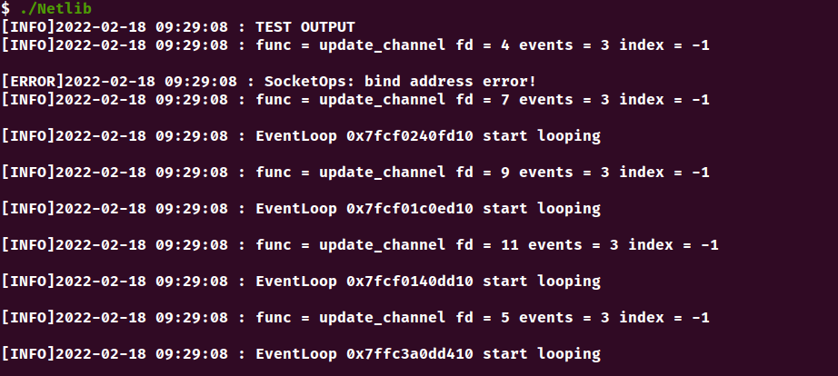

# NetLib

## 环境
<b> Ubuntu 20.04</b>  
<b>g++ (Ubuntu 9.3.0-17ubuntu1~20.04) 9.3.0</b>  
<b>cmake version 3.16</b>  
<b>Mysql 8.0.28</b>  

## 功能
1. <b>基于Epoll的Reactor模块</b>  
2. <b>基于阻塞队列的异步日志模块</b>  
3. <b>基于pthread封装的线程池</b>  
4. <b>基于set实现的定时器</b>
5. <b>基于queue实现的数据库连接池</b>

## 运行
1. 命令行运行

```
mkdir build && cd build<br>
cmake ..<br>
make -j 4<br>
```

2. 一键运行

```
./build.sh
```

## 运行截图
  

## 致谢
<b>《Linux高性能服务器编程》游双 著</b>  
<b>《Linux多线程服务端编程》陈硕 著</b>  
