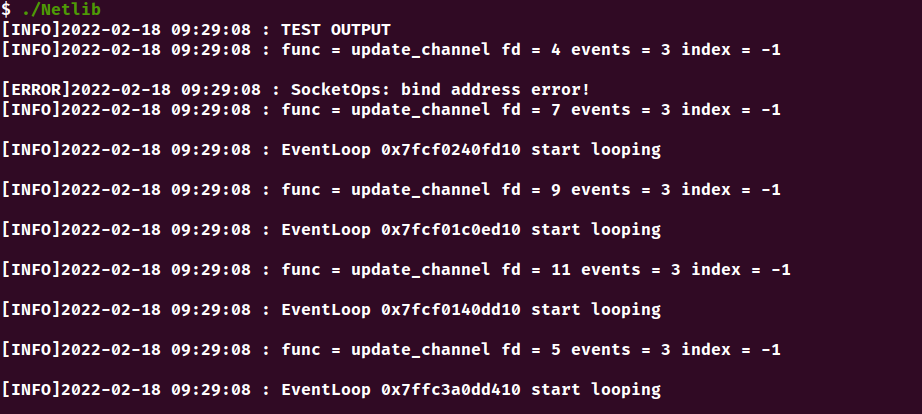

# NetLib

<b>关于HttpServer内容，请看[这里](https://github.com/WDXC/TakeAway)</b>

## 环境
```
Ubuntu 20.04
g++ (Ubuntu 9.3.0-17ubuntu1~20.04) 9.3.0
cmake version 3.16
Mysql 8.0.28
```

## 功能
1. <b>基于Epoll的Reactor模块</b>  
2. <b>基于阻塞队列的异步日志模块</b>  
3. <b>基于pthread封装的线程池</b>  
4. <b>基于set实现的定时器</b>
5. <b>基于queue实现的数据库连接池</b>

##  编译
1. 命令行

```
mkdir build && cd build
cmake ..
make -j 4
```

2. 一键编译

```
(sudo) chmod +x build.sh
. ./build.sh
```

## 运行截图
<b>EchoServer_test</b>

```
cd $PWD/build/bin/
./EchoServer
```

  


## 致谢
<b>《Linux高性能服务器编程》游双 著</b>  
<b>《Linux多线程服务端编程》陈硕 著</b>  
